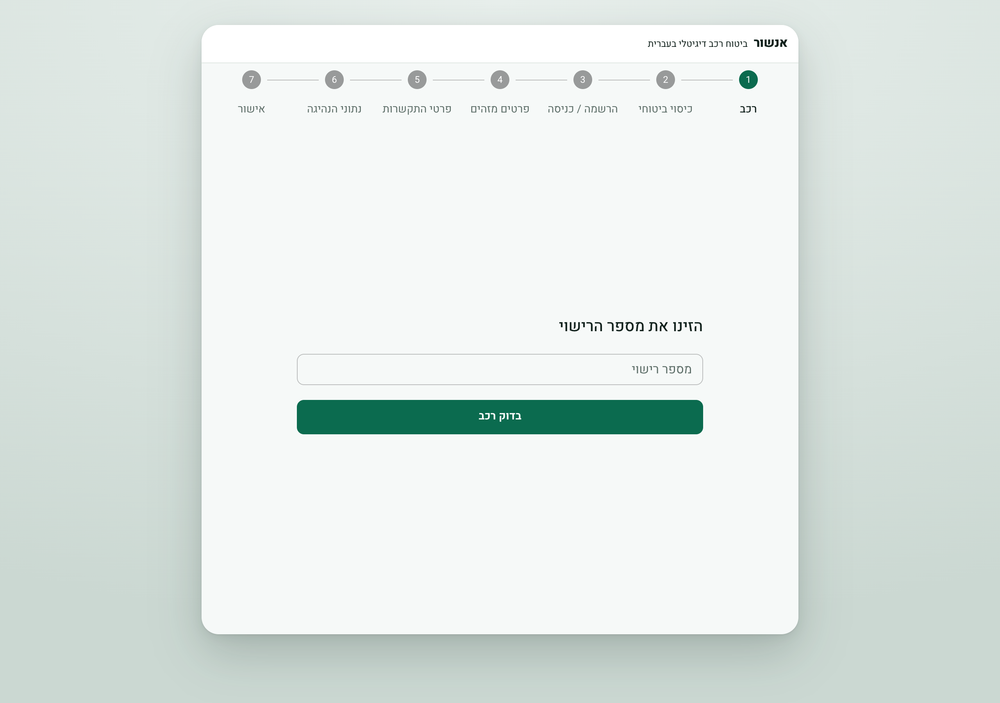
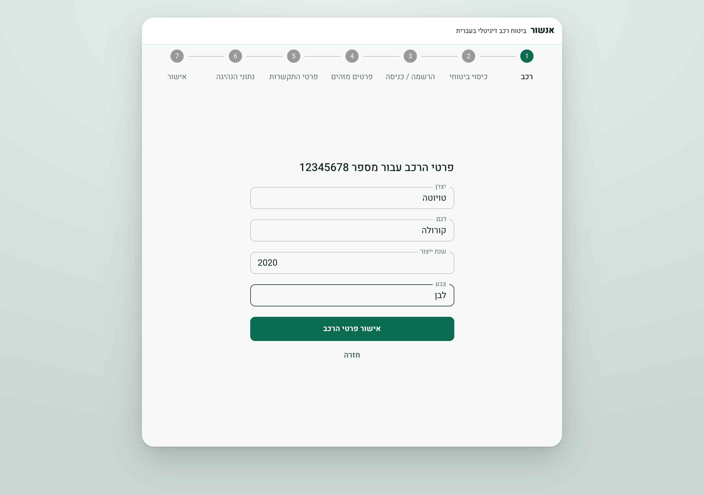
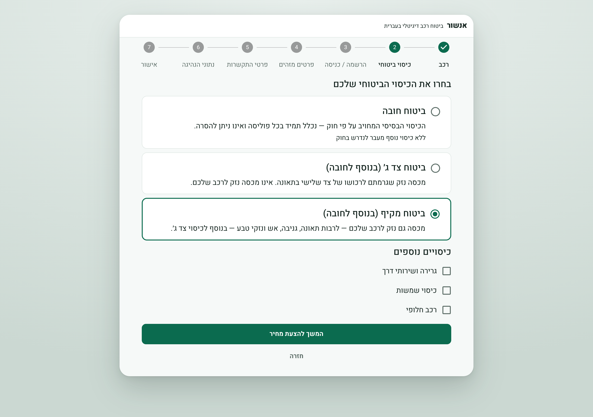
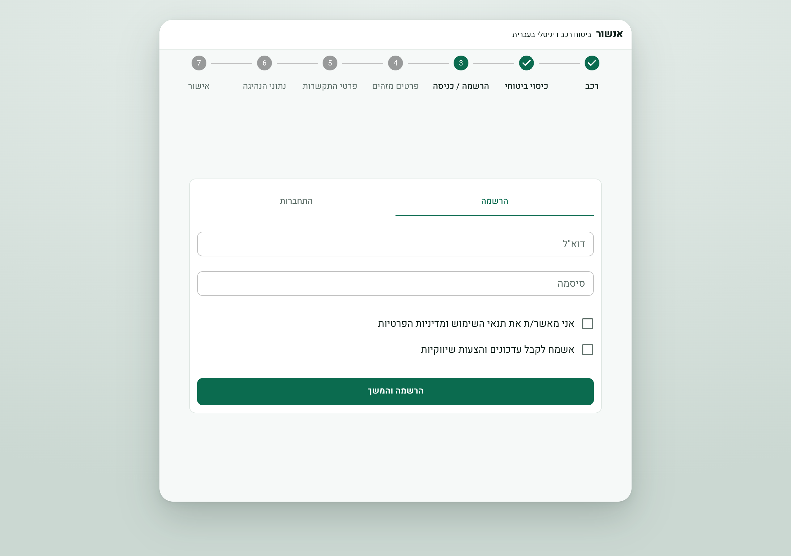
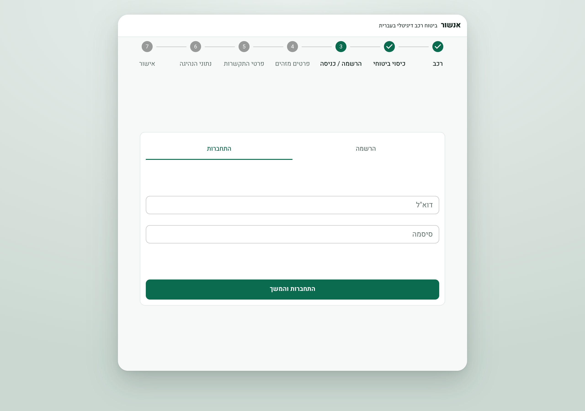
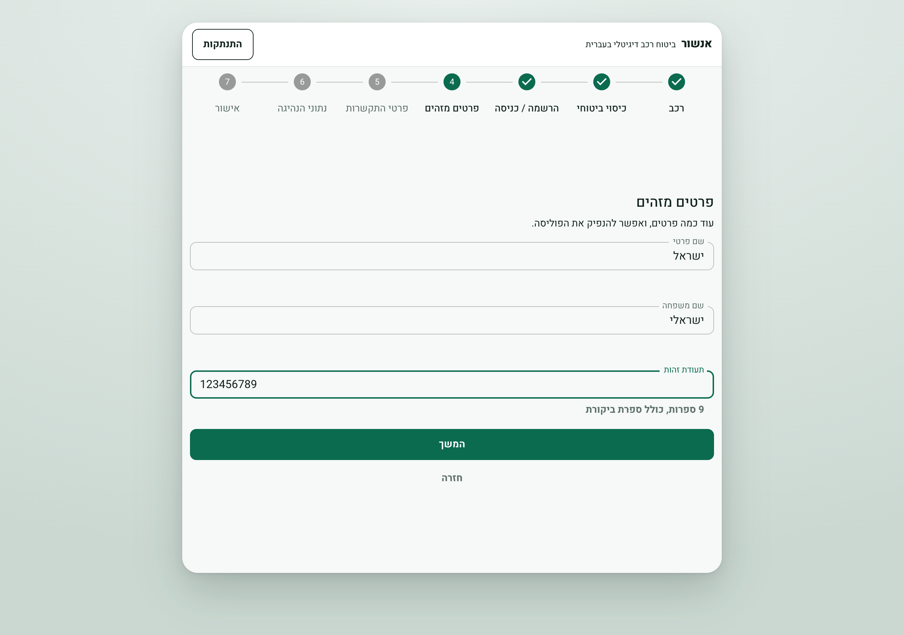
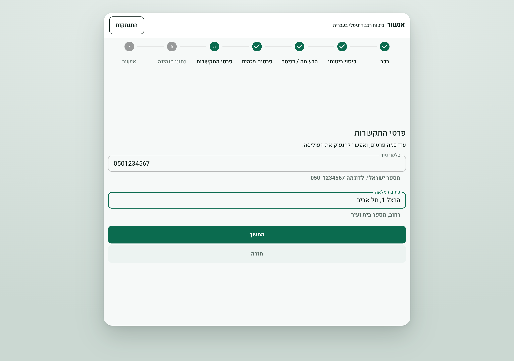
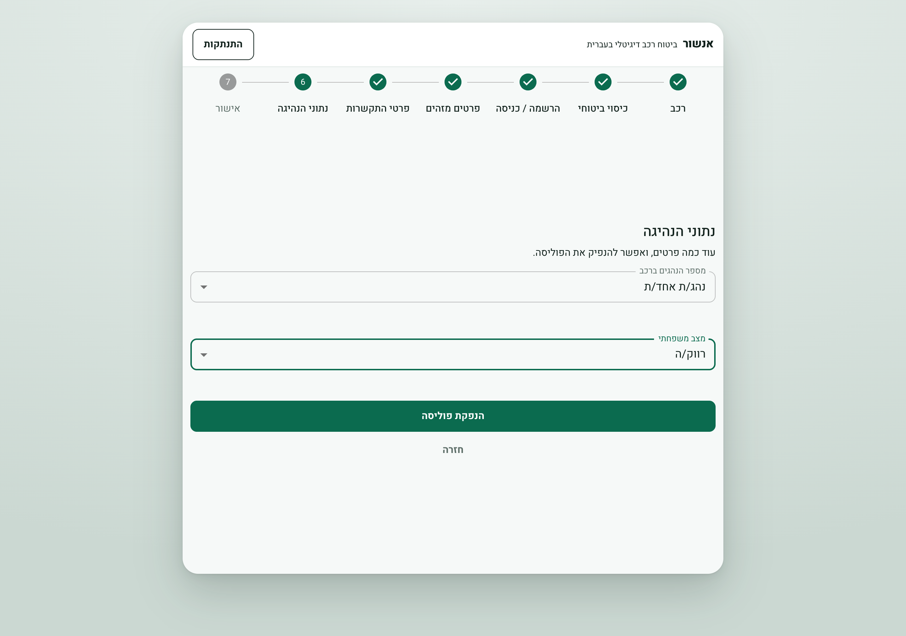
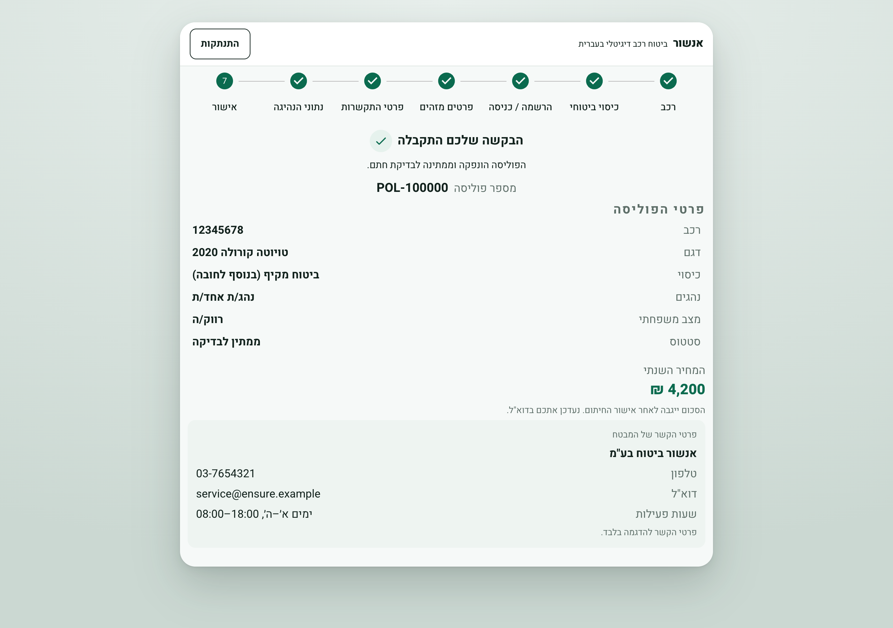
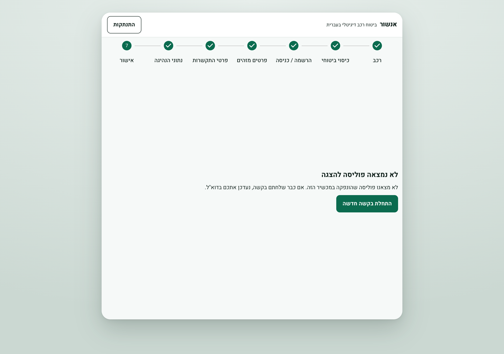

# Ensure

Digital car-insurance onboarding for Hebrew-speaking users. A React SPA walks the applicant
through vehicle and coverage selection, a policy gate with minimal authentication, and private
information forms backed by an Express/TypeScript API, a self-hosted Postgres

## Live

<https://164.90.160.169.sslip.io>

## Prerequisites

- Docker (Engine 25+ with the Compose v2 plugin)


## Run

```bash
git clone https://github.com/ItamarColler/Ensure.git
cd Ensure
docker compose up
```

Then open <http://localhost>.

No `.env` file is required for a local run — every secret-shaped variable falls back to an
obviously fake development default.
Copy `.env.example` to `.env` and fill it in for a real
deployment.

## Running with Docker Compose

```bash
docker compose up -d --wait     # start detached, block until healthchecks pass
docker compose logs -f api      # follow one service
docker compose ps               # what is running
docker compose down             # stop, keep the data
docker compose up -d --build    # rebuild after pulling changes
```


## Database and volumes

The stack defines one data volume, holding the Postgres cluster. 

```bash
docker compose down      # containers removed, volumes kept — data survives
docker compose down -v   # volumes destroyed — everything is gone
```

Open a shell on the database:

```bash
docker compose exec postgres psql -U ensure -d ensure
```


## Architecture

A request travels in one direction and never turns back:

```
router → controller → service → repository → database
                          ↘ client → insurer webhook
```

| Layer | Responsibility |
|---|---|
| `routers/` | Declare routes and compose middleware. |
| `middleware/` | The trust boundary: CSRF, rate limit, body validation, authentication. |
| `controllers/` | Read the validated body, call one service, hand the result to `sendResult`. |
| `services/` | Business logic and transaction boundaries. |
| `repositories/` | All SQL. The only layer that touches Drizzle. |
| `clients/` | Outbound HTTP to third parties, with timeouts. |
| `packages/shared/` | Zod schemas, for data validation and type inferences between frontend and backend |


## Backend stack

**TypeScript** — used across the API, the browser app and the package they share, so a change to
a data shape fails the build on both sides instead of at runtime.

**Express** — serves the JSON API behind the reverse proxy, with each route assembled from small
steps that validate, rate limit and authenticate before any business logic runs.

**PostgreSQL with Drizzle** — stores accounts, applications, vehicles, coverage choices and
issued policies, with every schema change committed as a migration that runs to completion before
the API accepts traffic.

**Zod** — validates every request arriving at the API and every form in the browser from one set
of schemas shared by both, so the two can never disagree about what a valid value is.

**JSON Web Tokens** — carry the session created at registration, held in a browser cookie that
page scripts cannot read, so an injected script cannot lift the session out of the browser.

**bcrypt** — hashes every password before it is stored, and runs even when the account does not
exist so an unknown email and a wrong password take the same time to fail.

## Frontend stack

**React with Vite** — builds the single-page wizard, served as static files by the same proxy
that fronts the API.

**MUI** — supplies every control and layout primitive, with colour, shape and spacing defined
once in a single theme rather than per screen.

**Emotion with its right-to-left plugin** — rewrites the generated styles for Hebrew, so the
whole interface mirrors correctly without maintaining a second stylesheet.

**React Router** — owns the order of the wizard, restoring the session before each screen decides
whether the applicant is allowed to be there and sending them back to the earliest step they have
not finished.

**React Hook Form** — drives every form in the flow, checking each field against the same schemas
the API enforces.

**Zustand** — keeps the applicant's answers while they move between steps, held for the life of
the browser tab and re-checked before being trusted again.

**TanStack Query** — performs every call to the API and owns the pending and error states the
screens display while a request is in flight.

**i18next** — holds all Hebrew copy as translation files kept out of the components, so adding
another language is a matter of adding files rather than editing screens.

## The onboarding flow

```
vehicle → coverage → register / login → identity → contact → driving → confirmation
└──────── anonymous ────────┘ └── gate ──┘ └────── private information ──────┘
```

> [!IMPORTANT]
> The ordering is the product decision. A cheap anonymous start earns a real price, the sign-up
> gate is placed where the applicant has already shown they mean it, and nothing sensitive is
> asked until they are inside their own account — about **five minutes** end to end.

**The car comes first, and costs almost nothing to give.** The applicant types a licence plate
and the rest of the vehicle's details come back from a public vehicle-data lookup, so **they part
with nothing sensitive and fill in almost nothing to reach a price**. For a product that ultimately
asks a lot of questions, that is the lightest possible way in.

**Reaching the sign-up screen is the signal.** An applicant who has chosen their cover and
arrived at the account step **has already put enough in to be likely to finish**, so that is the
right moment to ask them to commit. Nothing personal is requested there — only an account to hold
the quote they have just been shown.

> [!NOTE]
> **Sensitive details sit behind the login.** Name, identity number, address and phone are asked
> for only once the applicant is signed in, so **at the moment they hand anything sensitive over
> they are already inside their own account**. Most people are wary of giving that away to an
> anonymous web form, and this is what makes the request feel safe rather than intrusive.

**The forms are short on purpose.** The private stage is split into three quick screens — who you
are, how to reach you, who drives the car — rather than one long form that looks like work.
**Plate to issued policy runs to roughly five minutes.**

**The price moves as they answer.** The figure shown at the sign-up gate is an estimate from the
car and cover, and **it is labelled as one rather than dressed up as a quote**. It settles on the
final screens, where the number visibly updates as the applicant says how many drivers there are
and what their family status is.

**One deliberate simplification.** Real insurers ask about driver age before sign-up, because
compulsory cover is priced on it; here that question waits until afterwards, so an anonymous
visitor is never asked anything personal. The journey ends with a policy awaiting underwriter
review rather than a made-up payment step.

## Screens

| | |
|---|---|
| **Vehicle** — the applicant enters a licence plate; nothing personal is asked. |  |
| **Vehicle, confirmed** — details returned by the insurer lookup, editable before continuing. |  |
| **Coverage** — the three statutory tiers with add-ons for the selected tier. |  |
| **Register** — the gate. Terms are required; marketing consent is separate and optional. |  |
| **Login** — the same panel, toggled. A duplicate email flips it here without losing input. |  |
| **Identity** — the first private step: name and national ID. |  |
| **Contact** — phone and address. |  |
| **Driving** — driver count and family status, the two answers that move the premium. |  |
| **Confirmation** — the issued policy, its number, cover and final premium. |  |
| **Confirmation, no policy** — reached directly; it explains rather than redirecting. |  |

## Environment variables

| Variable              | Used by                | Local default                     | Purpose                                                                                                        |
| --------------------- | ---------------------- | --------------------------------- | -------------------------------------------------------------------------------------------------------------- |
| `POSTGRES_PASSWORD`   | postgres, migrate, api | `local-dev-not-a-real-password`   | Postgres superuser password for the `ensure` role                                                              |
| `JWT_SECRET`          | api                    | `local-dev-not-a-real-jwt-secret` | Signing key for session JWTs                                                                                   |
| `PUBLIC_HOSTNAME`     | caddy                  | `http://localhost`                | Caddy site address. A bare hostname enables automatic HTTPS; the `http://` prefix disables ACME for local runs |
| `INSURER_WEBHOOK_URL` | api                    | Cloud Run stub base URL           | Base URL of the insurer webhook (no path)                                                                      |

## Workspace layout

```
ensure/
├── apps/
│   ├── api/            Express 5 API, run with tsx in dev and production
│   │   ├── migrations/ drizzle-kit generated SQL, committed
│   │   └── src/{routers,controllers,services,repositories,clients,middleware,http,db}
│   └── web/            React 19 + Vite SPA, Hebrew RTL behind an i18n layer
│       ├── src/routes/ one directory per wizard step
│       └── src/i18n/he Hebrew resource namespaces
├── packages/
│   └── shared/         Zod schemas, premium engine and the Result<T> envelope, consumed as source
├── deploy/             Caddyfile and the Caddy image that serves the SPA and proxies /api/*
└── docs/screenshots/   The images above
```
